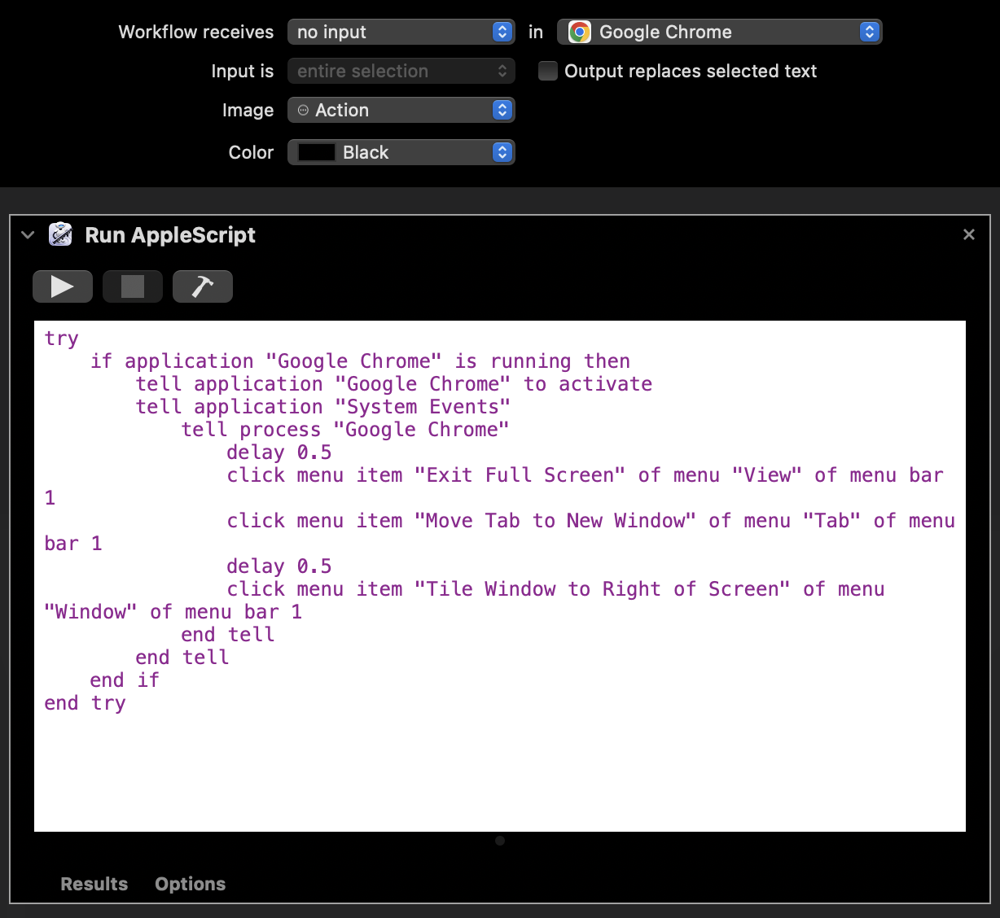
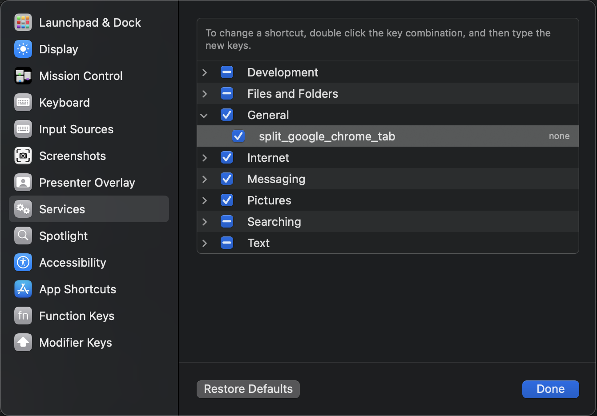
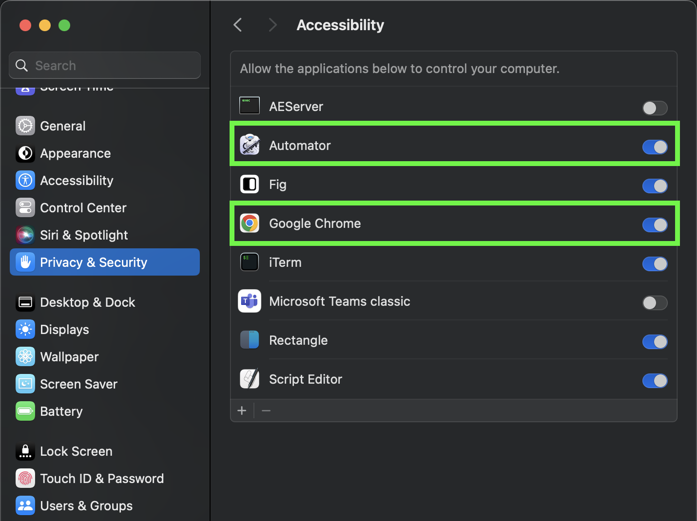
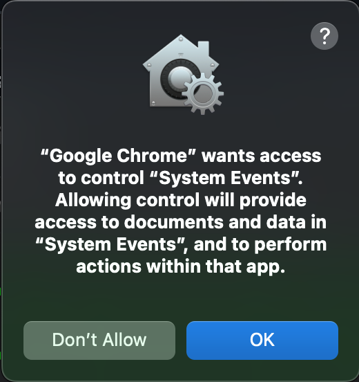
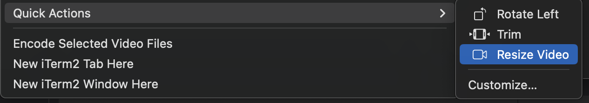
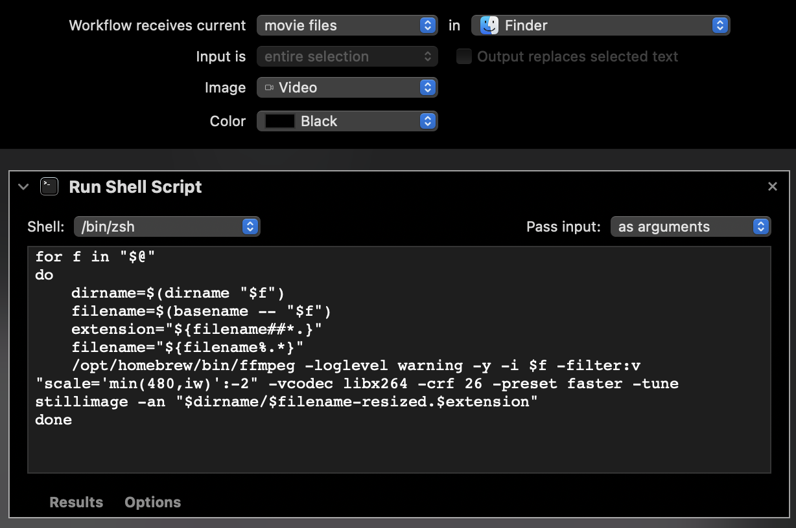

# Automation scripts for my Mac

[Split View Chrome Tabs](#split-view-chrome-tabs)  
[Resizing/Compressing screen recordings from mobile devices](#resizingcompressing-screen-recordings-from-mobile-devices)

## Split View Chrome Tabs

When in Google Chrome, will pull the active tab and move it to the right of the screen. Then it returns and lets the user pick the 2nd application to put to the left of the screen.  
I usually put the Chrome window from which the Tab was taken.  
It uses MacOS's native side-by-side view. Many apps, such as Rectangle, allow side by side view, but not in the full-screen native MacOS way.  
In this video, the automation starts immediately until the tab is set to the right of the screen. After that, it's all manual. I pick the other window to set on the left. And to go back, right click the tab and move it back to the other window.  
https://github.com/user-attachments/assets/2f14906b-1641-4c1c-b436-3873e7ac2913

1. Open Automator
2. Make a new Quick Action
3. Make sure it receives 'no input' at all programs
4. Select Run Apple Script and copy the content of split_view_chrome_tabs.scpt  

5. Save! (I used split_screen_google_chrome which you will find below)
6. Go to System Preferences > Keyboard > Shortcuts. Select Services from the sidebar and find your service (the name used above). Add a shortcut by double clicking (none). Click Done  

7. In System Preferences, go to Privacy & Security > Accessibility, allow Automator and Google Chrome  

8. The first time you use the short cut, you may be asked to allow Google Chrome to access System Events. Accept.  

8. We're done :tada:

## Resizing/Compressing screen recordings from mobile devices

Requires ffmpeg. Can be installed with Homebrew.  
When making a screen recording on iOS or Android, the videos are pretty fat thanks to our mobile devices huge resolutions and a lack of compression.  
So when I want to share a screen recording, usually at work on Slack or in Jira, I want it to be a reasonnable size. First, because it saves storage space and reduces the impact of my work on the environment, and second because it loads faster for everyone else in Slack or Jira.  
This trick usually achieves around 10x file size reduction and keeps a resonable quality, good enough to illustrate a bug or anything I want to share.  
This adds a quick action in Finder when right-clicking video files. It also works when selecting multiple video files. It keeps the original files and create new video files encoded and resized, keeps the format ratio (4:3, 16:9, etc), with the same name suffixed with `-resized`.  

1. Launch MacOS Automator
2. Select File → New
3. In the new window, select `Quick Action`, tap `Choose`
4. In the list of actions, select `Run Shell Script`, double click
5. Change the parameters as follow:  
Workflow receives current → `movie files` in `Finder`  
Image → `Video`  
Color → Whatever  
Content of script  
Shell: `/bin/zsh` (default)  
Pass input `as arguments`  
Content of the script → copy the content of resize_and_compress_mobile_screen_capture.sh  

6. Save the quick action with `CMD+S` or `File -> Save`, pick a name, save and close Automator
7. Enjoy! :tada:

